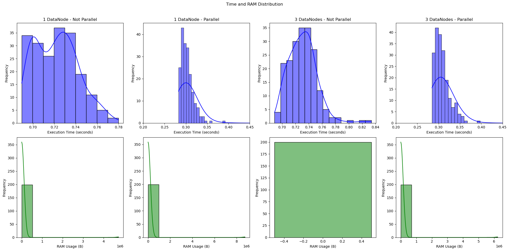

## Dataset

[Forest Cover Type Prediction Dataset](https://archive.ics.uci.edu/dataset/31/covertype): The dataset consists of various features like elevation, aspect, slope, and distances to predict forest cover types. It contains 581,012 instances and 54 features.

## Model

Decision Tree Classifier: The model is pre-trained using the Decision Tree algorithm. Model training details are available in the `train.py`.

## Spark Applications
Two Spark applications are created for data processing:
- single.py
- parallel.py

## How to Run

```bash
python train.py
docker-compose build
docker-compose up -d
docker cp covtype.data namenode:/
docker exec -it namenode bash
hdfs dfs -put /covtype.data /
docker exec -it -u 0 spark-master bash
chmod -R 777 /output
```

### Start Spark Applications

```bash
sh start.sh
```

### Resulting Graph
The resulting graph will illustrate the distribution of execution time and RAM usage for both parallel and non-parallel Spark applications across multiple iterations. The graph helps in understanding the performance and resource utilization differences between the two approaches.

